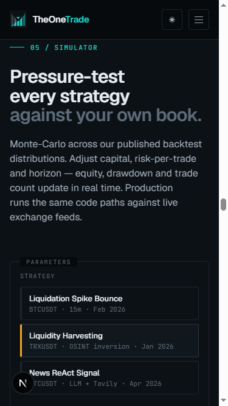

# TheOneTrade Landing

> Published at [theonetrade.github.io/](theonetrade.github.io/)

AI trading systems engineered against second-order chaos.



## Quick start

```bash
npm install
npm run dev
```

Open [http://localhost:3000](http://localhost:3000).

## Build for production

```bash
npm run build
```

Static export lands in `out/` (configured via `output: 'export'` in `next.config.mjs`). Deploy the `out/` folder to any static hosting.

## Stack

- **Next.js 15** — App Router, static export
- **React 19** — client components with hooks
- **CSS custom properties** — dark/light theme via `data-theme` attribute
- **Geist + JetBrains Mono** — typography

## Icons

- `public/icon.svg` — vector logo (any size)
- `public/icon-192.png` / `icon-512.png` — PWA manifest icons
- `public/apple-touch-icon.png` — iOS home screen
- `public/favicon.png` — browser tab
